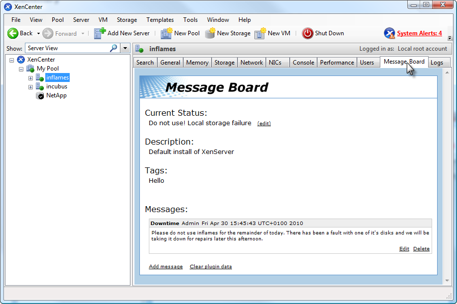

# XenCenter Plug-ins - Message Board Example - JavaScript

## Introduction

This is an advanced example of using JavaScript to make API calls to XenServer
on a XenCenter TabPage plug-in.

By using some modified jQuery libraries it is possible to run JavaScript from a
local `.html` file and pass RPC requests through XenCenter onto the server.
This enables you to create JavaScript based UI additions to XenCenter.

**Objective:** Add a Message Board for each of your server objects, where people
can post messages and status updates which are visible to other XenCenter users
that have installed the plug-in.

Note that this is a simple example designed to show what is possible using
JavaScript in a XenCenter TabPage plug-in to create dynamic pieces of user
interface, and as such is not supported or tested as a feature of XenCenter.

## Requirements and build

Ensure your system has

* [PowerShell](https://docs.microsoft.com/en-us/powershell/scripting/install/installing-windows-powershell) 3.0 or higher
* [WiX](https://wixtoolset.org) 3.7 or higher

To compile the plug-in installer, open a Visual Studio Command Prompt in the root
of this repo, navigate to the folder `JavaScript` and run the make file:

```sh
cd JavaScript
make.cmd
```

The result is output in the subfolder `_build`.

## Plug-in file

We define a tab page which uses the `relative` attribute to reference a local
`.html` file, and the `credentials` attribute to tell XenCenter to pass session
information to the HTML DOM:

```xml
<XenCenterPlugin xmlns="http://www.citrix.com/XenCenter/Plugins/schema" version="1" plugin_version="1.0.0.0">
  <TabPage
  name="Message_Board"
  url="Plugins/XenServer/MessageBoard/MessageBoard.html"
  relative="true"
  credentials="true"
  search="70ecbca9-20e7-4f57-b079-fe3aab968cbc"/>
  <Search
    uuid="70ecbca9-20e7-4f57-b079-fe3aab968cbc"
    name="MessageBoardObjects"
    major_version="2"
    minor_version="0"
    show_expanded="yes">
      <Query>
        <QueryScope>
          <Pool />
          <Server />
          <VM />
          <Snapshot />
          <UserTemplate />
          <DefaultTemplate />
          <RemoteSR />
          <LocalSR />
          <VDI />
          <Network />
        </QueryScope>
      </Query>
    </Search>
</XenCenterPlugin>
```

## Resources

Here is the resources table for this plug-in.

|Name|Value|
|---|---|
|MessageBoard.description|XenServer JavaScript plug-in example|
|MessageBoard.copyright|Copyright (c) Cloud Software Group, Inc.|
|MessageBoard.link|<https://docs.xenserver.com/en-us/xenserver/8/developer>|
|Message_Board.label|Message Board|

## HTML File

Here's the header where we reference the jQuery core library as well as our
modified RPC library and our own JavaScript file for the plug-in:

```html
<script type="text/javascript" src="jquery-1.3.2.js"></script>
<script type="text/javascript" src="jquery.rpc.js"></script>
<script type="text/javascript" src="MessageBoard.js"></script>
<link type="text/css" href="MessageBoard.css" rel="stylesheet"></link>
```

We want to have a current status message shown quite prominently, so we define:

* A heading
* A span `statusText` to update with this message
* Some text that the user can click on to edit this value.

```html
<div class="mainHeading" id="statusHeading">Current Status:</div>
<div class="regularBodyText">
  <span id="statusText">None</span>
  <span class="linkLabel" onClick="EditStatus()">(edit)</span>
</div>
```

It will also be nice to show some other values from the server, such as the
description and tags on the object. We will have these as read only.

```html
<div class="mainHeading" id="descriptionHeading">Description:</div>
<div class="regularBodyText" id="descriptionText">None</div>
<div class="mainHeading" id="tagsHeading">Tags:</div>
<div class="regularBodyText" id="tagsText">None</div>
```

Then we want a space for all the messages people can leave. We define a blank div
which the JavaScript will clear and populate each time we want to refresh.

```html
<div class="mainHeading" id="messagesHeading">Messages:
  <div id="messagesDiv"></div>
</div>
```

At the bottom we want some text the user can click to add a new message, or to
clear the plug-in data from the server object.

```html
<div class="bottomButtons">
  <span class="linkLabel" onClick="AddMessage()">Add message</span>
  <span class="linkLabel" onClick="ClearAll()">Clear plug-in data</span>
</div>
```

And finally an error div which we can show/hide when we encounter any problems.

```html
<div class="borderWrapperBottom" id="errorContent">
  There has been an unexpected error with the plug-in:
    <span id="errorMessage">Unknown Error</span>
</div>
```

## CSS

**Note for the curious:** Rather than anchor links, we are using spans and css
(with underlining and hand cursors) for our linkLabels. The main reason for this
is that the `document.ready` event in JavaScript didn't enjoy firing when the .NET
browser control navigated to a url with an anchor link on the end. As they don't
actually navigate anywhere, it seemed more appropriate to use spans and styles
in any case.

## JavaScript

Now we are going to create the MessageBoard.js script file that will populate the
blank bits of our HTML and read/write values to the server.

### RefreshPage and local variables

First of all we define our `RefreshPage` function as mentioned in the TabPage
Feature section of the plug-in specification. This function should be responsible
for tearing down and rebuilding the page, and is called by XenCenter whenever there
is a change of state which might need a rebuild (for example, to provide updated
session information).

```JavaScript
$(document).ready(RefreshPage);
function RefreshPage() {
  // hide the error div and show the main content div
  $("#content").css({"display" : ""});
  $("#errorContent").css({"display" : "none"});
  $("#errorMessage").html("");
  RefreshMessagesAndStatus();
  RefreshDescription();
  RefreshTags();
}
```

It clears out all of our content divs, hides the error feedback div and then
starts refreshing all the content.

We also define a few variables for use in the script. Our messages and status
text are stored on the other config maps of the server objects, so we need a key
which we will use to identify our data in these maps. We also have a local array
of messages to simplify interaction between our functions.

```JavaScript
// LOCAL VARIABLES SECTION
// Each message is a post on the message board and is stored on the other config
// map of the server object (a <string, string> map) under the key defined below.
// The value of this entry is a json encoding of an array of these messages, and
// each message has its string fields escaped so as not to break the xmlrpc.
// These fields are only escaped when they are put on the server, and are unescaped
// when saved to the local array (Messages).

var StatusString;
var StatusStringOtherConfigKey = "XCServerMessagesPluginStatus";
var Messages = new Array();
var MessageOtherConfigKey = "XCServerMessagesPlugin";
```

### Drawing, adding and encoding messages

Each message that a user can add to our message board is going to have a title,
name, date and a body. We use the title as a unique identifier for the message
to keep things simple:

```JavaScript
// MESSAGE OBJECT SECTION
// We force uniqueness on the titles and use it as a key for deleting and editing
function Message(t, n, d, b) {
  this.title = t;
  this.name = n;
  this.date = d;
  this.body = b;
}
```

When we write these messages to the server we are going to use JSON encoding, so
we define a helper function to escape and encode a message.

```JavaScript
function MessageToJson(message) {
  return '{"title" : "' + escape(message.title)
    + '", "name" : "' + escape(message.name)
    + '", "date" : "' + escape(message.date)
    + '", "body" : "' + escape(message.body) + '"}';
}
```

This is the HTML we want to inject to draw each message:

```JavaScript
function DrawMessage(Title, Name, Date, Body) {
  var newThread = '<div class="messageBox" id="message' + Title + '">'
    + '<div class="messageTitleBar">'
    +   '<span class="messageTitle">' + Title + '</span>'
    +   '<span class="messageAuthor">' + Name + '</span>'
    +   '<span class="messageDate">' + Date + '</span>'
    + '</div>'
    + '<div class="messageBody">' + Body + '</div>'
    + '<div class="messageFooter">'
    +  '<span class="linkLabel" onClick="EditMessage(\'' + Title + '\')">Edit</span>'
    +  '<span class="linkLabel" onClick="DeleteMessage(\'' + Title + '\')">Delete</span>'
    + '</div></div>';
  $("#messagesDiv").html($("#messagesDiv").html() + newThread);
}
```

Then we have the functions which are called by clicking on our linkLabels in the
`.html` file. These update our local array of messages and then save it all to
the server.

* The edit and delete functions use the Title of the message as a unique identifier
before deleting/recreating the message object
* The add and edit functions use simple JavaScript prompts to collect data

The add function is shown below as an example, if you would like to see the other
functions refer to the full MessageBoard.js.

```JavaScript
function AddMessage() {
  var title = prompt("Enter a title for your message", "");

  if (title == null || title == "") {
    alert("Cannot create a message without a title. Try again, choosing a non blank, unique title.");
    return;
  }
  var message;
  for (m in Messages) {
    if (Messages[m] != null && Messages[m].title == title) {
      message = Messages[m];
    }
  }
  if (message != null) {
    alert("A message already exists with that title. Try again, choosing a non blank, unique title.");
    return;
  }
  var name = prompt("Enter the authors name.", "");
  var body = prompt("Enter the body text of the message", "");
  var time = new Date();
  var m = new Message(title, name, time.toString(), body);
  Messages.push(m);
  SaveDataToServer();
}
```

### The misc. functions

Here is our first example of an XML-RPC call. It is a utility function used by
other bits of the script to retrieve the other config map of the selected object.

```JavaScript
// MISC FUNCTIONS SECTION
//  Retrieves the other config map for the currently selected XenCenter object
// and passes it on to the callback function
function GetOtherConfig(Callback) {
  var tmprpc;
  function GetCurrentOtherConfig() {
    var toExec = "tmprpc." + window.external.SelectedObjectType
      + ".get_other_config(Callback, window.external.SessionUuid, window.external.SelectedObjectRef);";
    eval(toExec);
  }
  tmprpc= new $.rpc("xml", GetCurrentOtherConfig, null,
    [window.external.SelectedObjectType + ".get_other_config"]
  );
}
```

We create an RPC object, telling it what code to evaluate once it has loaded
and the different server calls we will need to use in that code. Notice the use
of the `window.external` variable provided by XenCenter, and the callback that
the result will be passed to being defined as an additional first parameter to
the API call.

The parameters for the RPC constructor are as follows:

* Indicate that we want to use XML encoding rather than JSON.
* The function that should be evaluated once the RPC object has loaded.
* The XML version to use; the default is 1.
* A list of the different API calls we would like to make.

It is useful then to have another utility function to parse the result that we
get back from the server. The one we need here should update and hide/show the
error div with any relevant information.

```JavaScript
// The result object of any xmlrpc call to the server contains:
// - a result field which indicates whether it was succesfull or not,
// - a value field containing any returned data in json
// - an error description field containing any error information
// This function checks for success, displays any relevant errors, and returns a json object that corresponds to the value field
function CheckResult(Result) {
  var myResult = Result.result;
  if (myResult.Status == "Failure") {
    var message = myResult.ErrorDescription[0];
    for(var i = 1; i < myResult.ErrorDescription.length; i++) {
      message+="," + myResult.ErrorDescription[i];
    }
    $("#content").css({"display" : "none"});
    $("#errorContent").css({"display" : ""});
    $("#errorMessage").html(message);
    return;
  }
  if (myResult.Value == "") {
    return;
  }
  myResult = eval("("+myResult.Value+")");
  return myResult;
}
```

The result comes back as a JSON object for ease of evaluation.

### Retrieving data from the server

Leaving the other config to one side for a moment, a decent example of retrieving
a value from the server and populating our HTML with it is this chain of two
methods which refresh the tags div.

```JavaScript
// TAGS UPDATE SECTION
// This pair of methods chain to retrieve the server objects tags from the server
// and display them. There is no writing to the tags field on the server.
function RefreshTags() {
  var tmprpc;
  function RetrieveTags() {
    var toExec = "tmprpc." + window.external.SelectedObjectType
      + ".get_tags(ShowTags, window.external.SessionUuid, window.external.SelectedObjectRef);";
    eval(toExec);
  }
  tmprpc= new $.rpc("xml", RetrieveTags, null,
    [window.external.SelectedObjectType + ".get_tags"])
}
function ShowTags(TagsResult) {
  var result = CheckResult(TagsResult);
  if (result == null) {
    return;
  }
  var tags = "";
  for (t in result) {
    tags = tags + result[t] + ", ";
  }
  tags = tags.substring(0, tags.length - 2);
  if (tags == "") {
    tags = "None";
  }
  $("#tagsText").html(tags);
}
```

We also need a similar pair of functions to refresh the description div, which
you can see in the full MessageBoard.js.

### Writing data to the server

Finally, we have a chain of functions which:

* Remove all the messages from the objects other config map.
* Write the local message array to the other config map.
* Clear the status message from the other config map.
* Write the local status message to the other config map.
* Populate our HTML page with values from the server.

Here are the first pair which clear and write the message data:

```JavaScript
function ClearMessages() {
  var tmprpc;
  function RemoveMessagesFromOtherConfig() {
    var toExec = "tmprpc." + window.external.SelectedObjectType
      + ".remove_from_other_config(WriteMessages, window.external.SessionUuid, window.external.SelectedObjectRef, '"
      + MessageOtherConfigKey + "');";
    eval(toExec);
  }
  tmprpc= new $.rpc("xml", RemoveMessagesFromOtherConfig, null,
    [window.external.SelectedObjectType + ".remove_from_other_config"]
  );
}
function WriteMessages(RemoveMessagesResult) {
  var result = CheckResult(RemoveMessagesResult);
  var tmprpc;
  function WriteMessagesToOtherConfig() {
    var toExec = "tmprpc." + window.external.SelectedObjectType
      + ".add_to_other_config(ClearStatus, window.external.SessionUuid, window.external.SelectedObjectRef, '"
      + MessageOtherConfigKey + "', escape(output));";
    eval(toExec);
  }
  var output = "[";
  if (Messages.length > 0) {
    for (m in Messages) {
      output = output + MessageToJson(Messages[m]) + ",";
    }
    output = output.substring(0, output.length-1);
  }
  output = output + "]";
  tmprpc= new $.rpc("xml", WriteMessagesToOtherConfig, null,
    [window.external.SelectedObjectType + ".add_to_other_config"]
  );
}
```

## Screenshots


