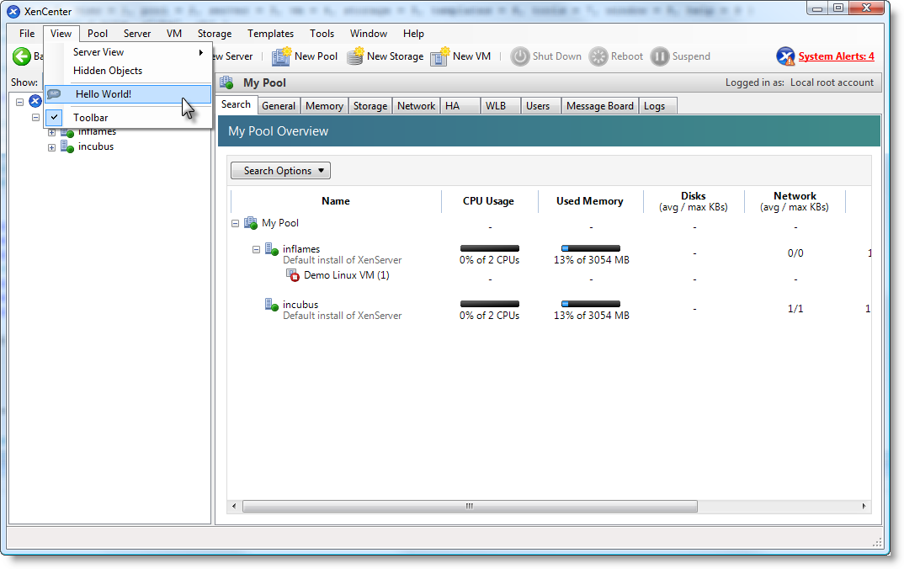
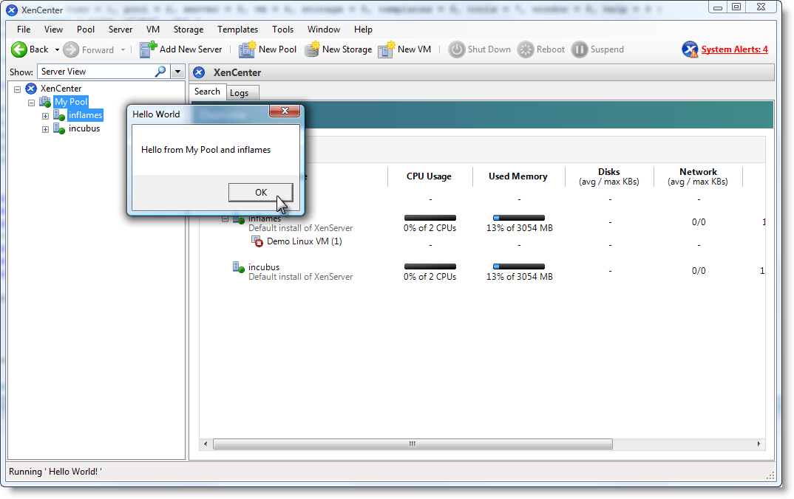

# XenCenter Plug-ins - Hello World Example - PowerShell

## Introduction

Here is a short example which will guide you through the creation of a XenCenter
plug-in. This example covers all the basics of producing a MenuItem plug-in for
XenCenter using PowerShell. It also demonstrates how to resource and deploy your
plug-in.

## Objective

We would like a new menu item in XenCenter which launches a pop-up
message saying "Hello from ..." followed by the names of whichever objects are
selected in the XenCenter resource list (treeview).

## Requirements and build

Ensure your system has

* [PowerShell](https://docs.microsoft.com/en-us/powershell/scripting/install/installing-windows-powershell) 3.0 or higher
* [WiX](https://wixtoolset.org) 3.7 or higher

To compile the plug-in installer, open a Visual Studio Command Prompt in the root
of this repo, navigate to the folder `PowerShell` and run the make file:

```sh
cd PowerShell
make.cmd
```

The result is output in the subfolder `_build`.

This example uses the XenServer PowerShell module (XenServerPSModule) to
communicate with the servers listed in XenCenter. This is available within the
XenServer [SDK](https://docs.xenserver.com/en-us/xenserver/8/developer/sdk-guide).

## Plug-in file

To add a menu item into XenCenter and call our PowerShell script we need to create
a plug-in configuration file.

We start with the `XenCenterPlugin` node with the following attributes:</p>

* `xmlns` Specifies the schema of the XML file.
* `version` The XenCenter Plug-ins version, we are using version 1.</li>

```xml
<XenCenterPlugin xmlns=http://www.citrix.com/XenCenter/Plugins/schema" version="1">
```

To create a menu item we add a `MenuItem` node under the `XenCenterPlugin` node.
We give this three attributes:

* `name` For identifying the menu item.
* `menu` The name of the menu under which the menu item should appear. Let's use
the 'View' menu.
* `serialized` Decides if copies of the plug-in running simultaneously are allowed
for the same object. Here we do not limit this so we set it to "none".

```xml
<MenuItem name="hello-menu-item" menu="view" serialized="none">
```

Next we add the XenServerPowerShell tag which points to a PowerShell script to run:

* `filename` The filepath of our target PowerShell script, relative to the install
directory of the XenCenter executable.
* `window` Whether to show the console window which runs the script. We don't
want this, let's turn it off.

```xml
<XenServerPowerShell filename="Plugins\XenServer\HelloWorld\HelloWorld.ps1" window="false" />
```

Close off all the tags and save as `HelloWorld.xcplugin.xml`. The name of this
file must be the same as the name of the plug-in directory in which it resides.

## Resources

The next step is to add some resources which provide strings and image paths for
the plug-in. These are stored in DLLs so that the correct language (if other
cultures are provided) can be loaded at run-time.

First we need to create the `.resx` file. This can be done using Visual Studio.
Add strings for the menu-item labels, copyright statements, filepaths to icons
etc. The names of the resources strings should be `<name>.<property>`, where
`<name>` is the name given to the tag and `<property>` is one of the properties
found in the specification. Here is the resources table for this plugin.

|Name|Value|
|---|---|
|HelloWorld.description|XenServer PowerShell plugin example|
|HelloWorld.copyright|Copyright (c) Cloud Software Group, Inc.|
|HelloWorld.link|<https://docs.xenserver.com/en-us/xenserver/8/developer>|
|hello-menu-item.label|Hello World!|
|hello-menu-item.description|Displays 'Hello World' from the selected object|
|hello-menu-item.icon|Plugins\XenServer\HelloWorld\HelloWorld.png|

 The final step is to convert this `.resx` into a DLL. We do this with two tools:

* `ResGen.exe` Creates a `.resources` file from the `.resx`. It can be found in
the .NET Framework SDK.
* `Al.exe` Embeds the `.resources` file into a DLL. We specify we want to create
a library, the file we wish to embed, and the name of the DLL file. `Al.exe` is
in the .NET Framework directory.

```sh
C:\Program Files\Microsoft Visual Studio 8\SDK\v2.0\Bin\ResGen.exe HelloWorld.resx
C:\WINDOWS\Microsoft.NET\Framework\v2.0.50727\al.exe /t:lib /embed:HelloWorld.resources
  /out:HelloWorld.resources.dll
```

The full XenCenter plug-in specification contains details on how to compile
additional resource DLLs for other cultures.

## The PowerShell script

We now need to write the script, which will compile a list of names from the
selected objects in the resource list and show a message box with our "Hello
from ..." in it.

XenCenter will pass in parameter sets to your plug-in to let you know what is
selected in the resource list, and to enable you to communicate with your connected
servers. PowerShell plug-ins can access these parameter sets from the `$ObjInfoArray`
variable which XenCenter populates before running your script. This handy variable
is an array of hashmaps. Each `$map` in `$ObjInfoArray` represents a parameter
set with the following keys:

* `$map["url"]` The URL of the server which owns the object selected in the tree
view.
* `$map["sessionRef"]` An authenticated session reference for the server (allows
the script to log into the server).
* `$map["class"]` The type of the object selected: server, VM etc.
* `$map["objUuid"]` The UUID for the selected object.

You will get:

* One parameter set per object selected in the resource list.
* One parameter set per object in a folder if a folder is selected.
* One parameter set per connected server if the user has the XenCenter node
selected. These are provided to allow you to communicate with any server if
launched from the XenCenter node, however the `class` and `objUuid`" keys will
be marked as blank.

```powershell
$SelectedObjectNames=@()
$XenCenterNodeSelected = 0

# the object info array contains hashmaps, each of which represent a parameter
# set and describe a target in the XenCenter resource list

foreach($parameterSet in $ObjInfoArray) {
  if ($parameterSet["class"] -eq "blank") {
    # When the XenCenter node is selected a parameter set is created for each of
    # your connected servers with the class and objUuid keys marked as blank

    if ($XenCenterNodeSelected) {
      continue
    }

    $XenCenterNodeSelected = 1
    $SelectedObjectNames += "XenCenter"
  }
  elseif ($parameterSet["sessionRef"] -eq "null") {
    # When a disconnected server is selected there is no session information,
    # we get null for everything except class
    $SelectedObjectNames += "a disconnected server"
  }
  else {
    Connect-XenServer -url $parameterSet["url"] -opaqueref $parameterSet["sessionRef"]

    # Use $class to determine which server objects to get
    #-Uuid allows us to filter the results to just include the selected object

    $exp = "Get-Xen{0} -Uuid {1}" -f $parameterSet["class"], $parameterSet["objUuid"]
    $obj = Invoke-Expression $exp
    $SelectedObjectNames += $obj.name_label
  }
}
```

Looking at that final `else` block you can see that before any server commands
can be used we need to connect to the server. We use the `sessionRef` from the
existing connection in XenCenter which means we don't need to provide any new
credentials.

```powershell
Connect-XenServer -url $parameterSet["url"] -opaqueref $parameterSet["sessionRef"]
```

Then when we use commands which automatically use the session from the last
`Connect-XenServer` call. We construct an expression using the class and uuid
information we were given which will retrieve the object selected in the resource
list.

```powershell
$exp = "Get-XenServer:{0} -properties @{{uuid='{1}'}}" -f $parameterSet["class"], $parameterSet["objUuid"]
$obj = Invoke-Expression $exp
```

Next we construct a sentence out of our list of names and, finally, we use .NET
Windows Forms to create an alert box by loading the correct DLL.

```powershell
$NameString = "Hello from {0}." -f ($SelectedObjectNames -join ', ')

Reflection.Assembly]::loadwithpartialname('system.windows.forms')
[System.Windows.Forms.MessageBox]::show($NameString, "Hello World")
```

## Screenshots



