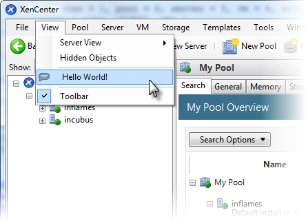

# XenCenter Plug-in Development

XenCenter is the management console used with XenServer, a leading open
source virtualization platform, powered by the
[Xen Project hypervisor](http://xenproject.org/developers/teams/hypervisor.html)
and the [XAPI toolstack](http://xenproject.org/developers/teams/xapi.html). From
XenCenter you can natively perform common operations such as starting, stopping
and migrating a VM, and administering the XenServer resource pool which
hosts those VMs. While these common operations are seemlessly handled, there are
times when external operations are needed. To address those scenarios, XenCenter
implements a plug-in architecture.

The XenCenter plug-in capabilities allow you to add custom menu items or even
whole tabs to the XenCenter window. You might do this as an ISV to integrate your
own product with XenCenter, or as an end-user to integrate with your company's
existing inventory management. Plug-ins can be added which extend menu items, or
which present entire user interfaces within the XenCenter tab structure. When
extending a menu, Microsoft PowerShell or a Windows executable are typically used.
Adding new tabs is typically accomplished with a web page, or other network service.



## XenCenter Plug-in Specification

[XenCenter Plug-in Specification Guide](https://docs.citrix.com/en-us/citrix-hypervisor/developer/xencenter-plugin-specification.html)
contains the complete specification for developing XenCenter plug-ins.

## Tutorials and Examples

The following samples demonstrate various ways in which a XenCenter plug-in can
be implemented.

* [Hello World Example - PowerShell](PowerShell.md)
* [Web UI Tab Example](WebUI.md)
* [Message Board Example - JavaScript](JavaScript.md)

## To build the sample plug-in installers

The best way to distribute your XenCenter plug-in is to package it into a single
`.msi` (Windows Installer) file. Using a Windows Installer allows you to make
sure the plug-in is being installed into the correct place (by checking the
XenCenter `InstallDir` registry key), and it also allows versioning. A newer version
will automatically uninstall the old version and then install the new one.

To compile an installer for each of the plug-in samples ensure your system has

* [PowerShell](https://docs.microsoft.com/en-us/powershell/scripting/install/installing-windows-powershell) 3.0 or higher
* [WiX](https://wixtoolset.org) 3.7 or higher

Then open a Visual Studio Command Prompt in the root of this repo, navigate to
the folder of each sample and run the corresponding make file. For example, to
compile an installer for the Web UI Tab plug-in:

```sh
cd WebUI
make.cmd
```

The result is output in the subfolder `_build` of each sample.

## Parameter Management

XenCenter provides parameter sets to your plug-in which describe the current
selection in the XenCenter resource list. Working with parameters can be somewhat
challenging, therefore we recommend you consult the plug-in specification for more
information.

## Community-contributed Plug-ins

Martin Zugec has authored a series of blogs which contain plug-ins to perform
common tasks.

* [XenCenter Plug-ins Collection (v5)](https://www.citrix.com/blogs/2016/03/28/xenserver-plugins-collection-v5/)
* [Connect to a VM via RDP, access Windows Services on the VM and open the Event Log](http://blogs.citrix.com/2012/09/08/extend-your-xencenter-rdp-connect-open-services-and-event-viewer/)
* [Access local disk drives in Windows VMs](http://blogs.citrix.com/2013/03/18/xencenter-plugins-v2/)
* [Connect to a VM via SSH, WinSCP and integrating Putty](http://blogs.citrix.com/2013/07/03/xencenter-plugins-v3/)
