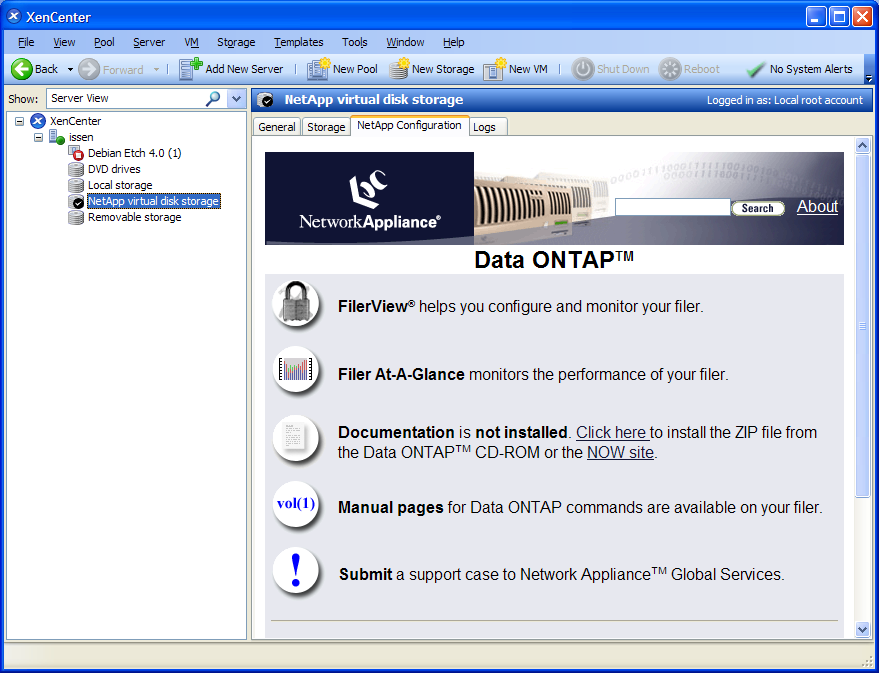

# XenCenter Plug-ins - Web UI Tab Example

## Introduction

This article is a guide through the steps to create a XenCenter TabPage plug-in.
It assumes you are familiar with the [Hello World Example - PowerShell](PowerShell.md).

This type of plug-in adds a new tab page for particular objects in the tree view
in XenCenter. The url can be context sensitive making the contents of the tab
relevent to the current server, for example.

In this example we will create a plug-in called NetAppWebUI, which creates a tab
displaying the web interface for a Network Appliance storage repository. To use
the plug-in you will need a NetApp SAN.

## Requirements and build

Ensure your system has

* [PowerShell](https://docs.microsoft.com/en-us/powershell/scripting/install/installing-windows-powershell) 3.0 or higher
* [WiX](https://wixtoolset.org) 3.7 or higher

To compile the plug-in installer, open a Visual Studio Command Prompt in the root
of this repo, navigate to the folder `WebUI` and run the make file:

```sh
cd WebUI
make.cmd
```

The result is output in the subfolder `_build`.

## Plug-in file

The plug-in is described by a `.xcplugin.xml` file. The tab page is described by
a TabPage xml node. We need to give it a `url` and a `search` to determine which
tree view items make the tab page appear.

The URL can contain context sensitive variables. They have the form `{$variable}`
and get replaced each time the web page is loaded. In this example the URL is
the web address of the NetApp web interface. This is at
`http://<storage IP address>/na_admin`. We also need to specify the UUID
of a search which we are going to add the plug-in descriptor.

```xml
<TabPage name="webui-tab" url="http://{$ip_address}/na_admin/" search="4f40121b-cc67-4b38-a93b-e72959bf0904" />
```

The search is more tricky. We can get a rough skeleton from a search exported
from XenCenter. The search used is _Search for All Storage Repositories_. We
cannot get the entire search because you cannot filter by SR type in XenCenter.
We need to add a `Query` to the XML manually. The property `sr_type` is
an `Enum` so we need an `EnumPropertyQuery`.

```xml
<Search uuid="4f40121b-cc67-4b38-a93b-e72959bf0904" name="NetApp SRs" major_version="2" minor_version="0" show_expanded="yes">
  <Query>
    <QueryScope>
      <RemoteSR />
      <LocalSR />
    </QueryScope>
    <EnumPropertyQuery property="sr_type" equals="yes" query="netapp" />
  </Query>
</Search>
```

The whole plug-in descriptor is contained in NetAppWebUI.xcplugin.xml.

## Resources File

Here is a list of labels used in the resources file.

|Name|Label|
|---|---|
|NetAppWebUI.description|Show NetApp web interface in XenCenter.|
|NetAppWebUI.copyright|Copyright (c) Cloud Software Group, Inc.|
|NetAppWebUI.link|<https://docs.citrix.com/en-us/citrix-hypervisor/developer.html>|
|webui-tab.label|NetApp Configuration|

## Screenshots


